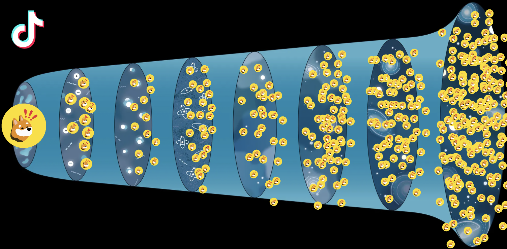

# Big Bonk ❗️❗️❗️

_Network of nano-influencers on TikTok creating content for a small BONK package._

Similar to the Big Bang theory, which describes the origin of the Universe, the Big Bonk gains momentum and spread on TikTok through brand deals with nano-influencers.

**Nano-influencers** are social media users with 100 to 10,000 followers.

This type of onboarding is similar to an airdrop in the sense that these influencers would get a **portion of $BONK for a sponsored post on TikTok**.

Distribution of $BONK can come from the BONK DAO Treasury or BONK Foundation.

### Problem: 

Many crypto projects are eager to expand their marketing initiatives to new communities like TikTok, but few actually take action. Why? They face several challenges:

- Lack of in-house expertise.
- Creating content is time-consuming.
- TikTok users have a specific community language different from Twitter users.

Influencers who are already active on the platform and striving to grow and differentiate themselves are more appreciative and easier to reach compared to those with a higher number of followers.

We understand that onboarding can be challenging, so we will assist by providing wallet setup and the initial SOL configuration for each influencer.

**In a nutshell, our strategy is to build a core Solana and Bonk nano-influencers army on TikTok by offering them brand deal in $BONK for a piece of organic content.**  

### Key advantages for the wider Solana community: 
- Onboard the core community on Solana by having them set up a wallet to receive their first Solana and BONK.
- Open the door for other protocols and projects to reward users for content with their respective tokens or through various deals.

### Roadmap:

- Identify and contact 100 nano-influencers to offer them a brand deal comparable to an airdrop.
- Successfully onboard at least 50 influencers in the next 2 months. Educate them, review the content they create, and upon successful completion of tasks:
- Set up and receive $BONK (e.g., 1M $BONK = USD $25.90 at the time of writing).
- Continue the growth of both @bonkmaxxing agency and the core community by allocating mini-grants to support specific initiatives that align with BONK community values.

**Bonk Maxxing agency** will conduct all influencer identification, management, education about BONK and the Solana ecosystem, and distribution of $BONK.

With this core base of Solana power users, we can extend our support to other projects while also nurturing the growth of these emerging nano-influencers.

### Why we? 

[@xentoshi](https://twitter.com/xentoshi) is a DevRel, a long-term enthusiast of Solana and Bonk, and the founder of a non-profit organization called laptopDAO.